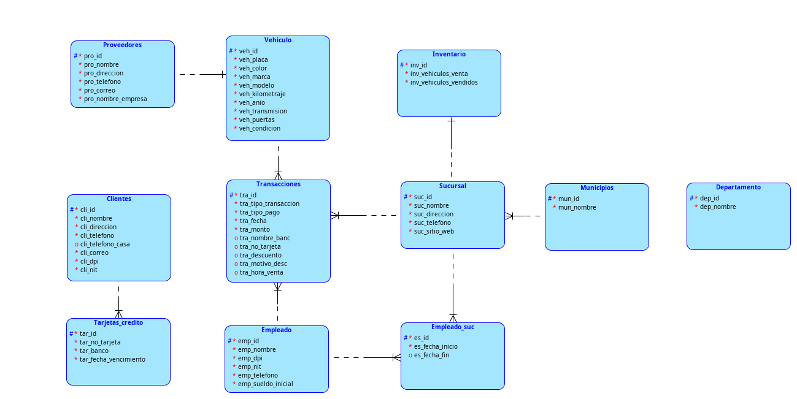
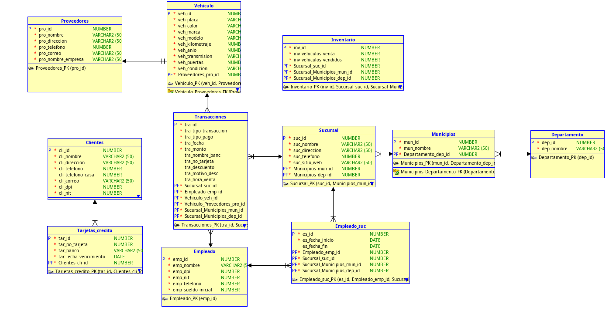

# DOCUMENTACION
Modelo conceptual: 

**Vehiculo**
- veh_id
- veh_Placa (#)
- veh_color
- veh_marca
- veh_modelo
- veh_kilometraje
- veh_anio
- veh_trasmision
- veh_No. puertas
- veh_Condicion
- veh_proveedor (foranea Pro_id)

**Sucursal**
- Suc_id (#)
- Suc_nombre
- Suc_direccion
- Suc_telefono
- Suc_sitio_web
- Suc_Mun_id (foranea)

**Municipios**
- Mun_id (#)
- Nombre
- Dep_id (foranea)

**Departamentos**
- Dep_id (#)
- Nombre

**Inventario**
- Inv_id (#)
- Inv_vehiculos_venta
- Inv_vehiculos_vendidos
- Inv_sucursal (foranea Suc_id)
- Inv_id_vehiculo (foranea veh_id)

**Transacciones**
- Tra_id(#)
- Tra_tipo_transaccion (venta o compra)
- Tra_tipo_pago (credito o contado)
- Tra_fecha
- Tra_monto
- Tra_nombre_banco (opcional)
- Tra_NO_tarjeta (opcional)
- Tra_descuento (opcional)
- Tra_motivo_descuento (opcional)
- Tra_hora_venta(solo caso de venta)
- Tra_Emp_id (foranea)(en caso de venta)
- Tra_veh_id (foranea)
- Tra_suc_id (foranea)

**Clientes**
- Cli_id (#)
- Cli_nombre_completo
- Cli_direccion
- Cli_telefono (obligatorio)
- Cli_telefono_casa
- Cli_correo  (obligatorio)
- Cli_DPI (obligatorio)
- Cli_NIT (obligatorio)

**Tarjetas_Credito**
- Tar_id (#)
- Tar_NO_tarjeta
- Tar_Banco
- Tar_Fecha_vencimiento
- Tar_cli_id (foranea)

**Proveedores**
- Pro_id(#)
- Pro_NOmbre_completo
- Pro_Direccion
- Pro_telefono
- Pro_correo
- Pro_nombre_empresa

**Empleados**
- Emp_id (#)
- Emp_nombre
- Emp_dpi
- Emp_nit
- Emp_telefono
- Emp_sueldo_inicial (2300)

**Empleado_sucursales**
- fecha_inicio
- fecha_fin (opcional)
- Emp_id (foranea)
- Suc_id (foranea)

## MODELO LOGICO

## MODELO RELACIONAL

## RELACIONES
### VEHICULO:
* Se establecio una relacion de uno a muchos con la tabla *Transacciones* ya que un vehiculo puede tener una transaccion cuando fue adquirido por la sucursal y una transaccion cuando fue vendido por la sucursal.  
### SUCURSAL:
* Se establecio una relacion de uno a muchos con la tabla *Transacciones* ya que una sucursal va estar involucrada en muchas transacciones ya se de venta o compra. 
* Se establecio una relacion de uno a muchos con la tabla *Empleados_suc* esta tabla es una tabla auxiliar para eliminimar la relacion de muchos a muchos con la tabla *Empleados*, lo que quiere decir que un empleado puede trabajar en varias sucursales. 
* Se establecio una relacion (uno a uno) con la tabla *Inventario* ya que cada sucursal tendra un inventario. 

### MUNICIPIOS
* Se establecio una relacion de uno a muchos con la tabla *Sucursales* ya que un Munucipio puede tener varias sucursales. 

### DEPARTAMENTOS
* Se establecio una relacion de uno a muchos con la tabla *Munucipio* ya que un Departamento esta compuesto de varios municipios. 

### CLIENTE
* Se establecio una relacion de uno a muchos con la tabla *Tarjetas* ya que un cliente puede tener varias tarjetas de credito/debito. 

### Empleado 
* Se establecio una relacion de uno a muchos  con la tabla *Transacciones* ya que un empleado puede vender muchos vehiculos generando muchas transacciones con su nombre. 
* Se establecio una relacion de uno a muchos con la tabla *empleado_suc* Ya que un empleado puede trabajar en varias sucursales. 
