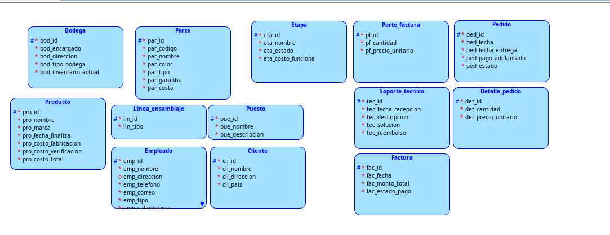
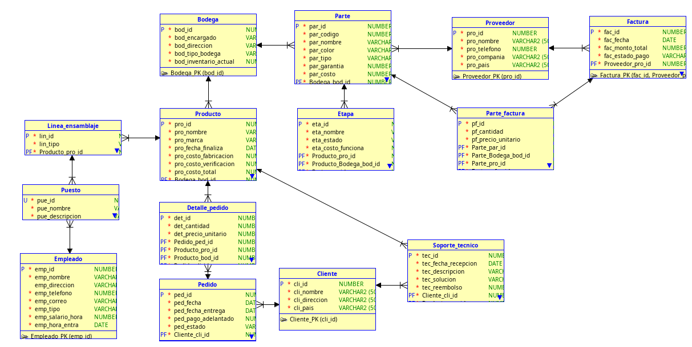

# DOCUMENTACION

**Bodega**
- bod_id (#)
- bod_encargado
- bod_direccion
- bod_stock_productos
- bod_tb_id (foranea)

**Partes**
- Par_id (#)
- Par_codigo
- Par_nombre
- Par_color
- Par_tipo
- Par_garantia
- Par_costo
- Par_pro_id (foranea)
- Par_bod_id (foranea)

**Producto**
- Pro_id (#)
- Pro_codigo
- Pro_nombre
- Pro_marca
- Pro_fecha finalizo
- Pro_costo_fabricacion (manoobra y maquinaria)
- Pro_costo_verificacion
- Pro_costo_partes
- costo_total
- Pro_id_empleado_finalizo 
- Pro_id_puesto_finalizado 
- Pro_id_bodega (foranea)

**Linea_samblaje**
- Lin_id (#)
- Lin_tipo 
- Lin_pro_id (foranea)

**Puesto**
- pue_id (#)
- pue_nombre
- pue_descripcion
- pue_lin_id (foranea)
- pue_emp_id (foranea)

**Empleado**
- emp_id (#)
- emp_Codigo
- emp_Nombre
- emp_Direccion
- emp_telefono
- emp_correo
- emp_tipo_empleado
- emp_salario_hora
- emp_horario_entrada

**Etapa**
- eta__id
- eta_nombre
- eta_estado
- eta_costo_funcionamiento
- eta_pro_id (foranea)
- eta_par_id (foranea)

**Proveedor**
- prv_id (#)
- prv_nombre
- prv_telefono
- prv_compania
- prv_pais

**Factura**
- fac_id
- fac_fecha
- fac_monto_total
- fac_estado_pago
- fac_prv_id (foranea)

**Parte_factura**
- pf_id (#)
- pf_cantidad
- pf_precio_unitario
- pf_par_id (foranea)
- pf_fac_id (foranea)

**Cliente**
- cli_id (#)
- cli_nombre
- cli_direccion
- cli_pais

**Pedido**
- ped_id (#)
- ped_fecha_pedido
- ped_fecha_entrega
- ped_pago_adelantado
- ped_estado
- ped_cli_id

**Detalle_Pedido**
- dp_id (#)
- dp_cantidad
- dp_precio_unitario
- dp_pro_id (foranea)
- dp_ped_id(foranea)

**Soporte_tecnico**
- st_fecha_recepcion
- st_descripcion
- st_solucion 
- st_reembolso
- st_pro_id (foranea)
- st_cli_id (foranea)

## Modelo Logico

## Modelo Relacional 

## RELACIONES

### BODEGA:

* Se establecio una relacion de uno a muchos con la tabla *Parte* ya que una bodega pueda almacenar varias partes para la construccion de computadoras o celulares

* Se establecio una relacion de uno a muchos con la tabla *Producto* ya que una bodega puede almacenar varios tipos de productos ya sea en produccion o finalizados. 

### PARTE:
* Se establecio una relacion de uno a muchos con la tabla *Etapa* ya que una etapa puede necesitar de varias partes para poder armar el producto final.

### PRODUCTO:
* Se establecio una relacion de uno a muchos con la tabla *Etapa* ya que en una etapa puede estar varios productos (etapa de finalizado o etapa de armado)
* Se establecio una relacion de uno a muchos con la tabla *linea_ensamblaje* ya que una producto puede tener una o mas lineas de ensamblaje. 

### LINEA_ENSAMBLAJE:
* Se establecio una relacion de uno a muchos con la tabla *Puesto* ya que una linea de ensamblaje esta conformada de varios puestos de trabajo. 

### EMPLEADO: 
* Se establecio una relacion de uno a muchos con la tabla *Puesto* ya que un empleado puede trabajar en varias plantas y por tanto en esas plantas puede estar en puestos diferentes. 

### PROVEEDOR:
* Se establecio una relacion de uno a muchos con la tabla *Partes* ya que un proveedor puede dar varias partes para el armado de los producotos 
* Se establecio una relacion de uno a muchos con la tabla *Factura* ya que los proveedores generan facturas de cada venta que realizan. 

### Factura 
* Se establecio una relacion de uno a muchos con la tabla *Parte_factura* ya que esta tabla es util para establecer todos los detalles de la venta realizada por el proveedor. 

### CLIENTE:
* Se establecio una relacion de uno a muchos con la tabla *Pedido* ya que un cliente puede atender varios pedidos 
* Se establecio una relacion de uno a muchos con la tabla *Soporte_tecnico* ya que se necesita saber que cliente fue el que vendio el producto que se esta devolviendo a la empresa. 

### PEDIDO: 
* Se establecio una relacion de uno a muchos con la tabla *Detalles_pedido* ya que un pedido puede tener muchos muchos detalles sobre la cantidad y tipos de productos. 

