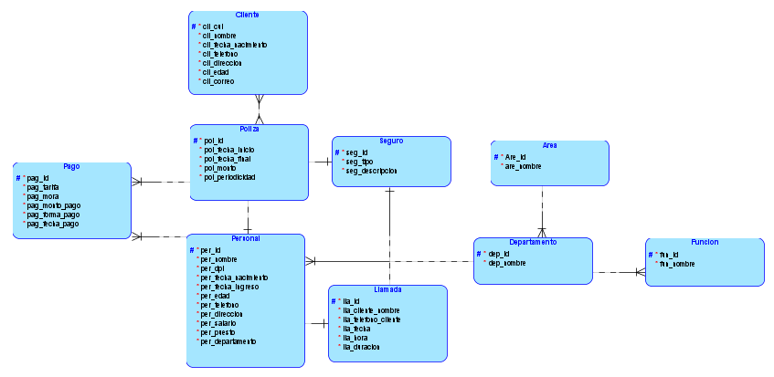
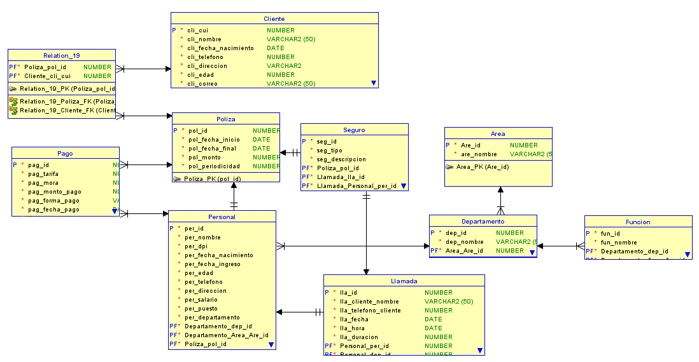

# DOCUMENTACION

## MODELO LOGICO

## MODELO RELACIONAL

## RELACIONES

### PERSONAL
* Se establecio una realcion de uno a uno con la tabla *Llamada* ya que una llamada solo puede ser atendidad por un empleado y un empleado solo puede atender una llamada a la vez. 
* Se establecio una relacion de uno a muchos con la tabla *Pago* ya que un empleado puede registriar varios pagos realializados por cualquier cliente.

### DEPARTAMENTO
* Se establecio una relacion de uno a muchos con la tabla *Personal* ya que un departamento puede tener a mucho personal trabajando en el. 
* Se establecio una relacion de uno a muchos con la tabla *Funcion* ya que un departamento contiene una serie de funciones que ejecutar. 

### AREA
* Se establecio una relacion de uno a muchos con la tabla *Departamento* ya que una area esta dividida en varios departamentos. 

### Llamada
* Se establecio una relacion de uno a uno con la tabla *Seguro* ya que al realizar una llamada solo se estara atendiendo un tipo de seguro especifico

### CLIENTE
* Se establecio una relacion de muchos a muchos con la tabla poliza, ya que mucho clientes pueden tener varias polizas (5). 

### POLIZA 
* Se establecio una relacion de uno a muchos con la tabla *Pago* ya que una poliza se puede pagar en intervalos de tiempo, por tanto se registraran varios pagos sobre una poliza. 
* Se establecio una relacion de uno a uno con la tabla *seguro* ya que una poliza se crea en base a un unico seguro. 