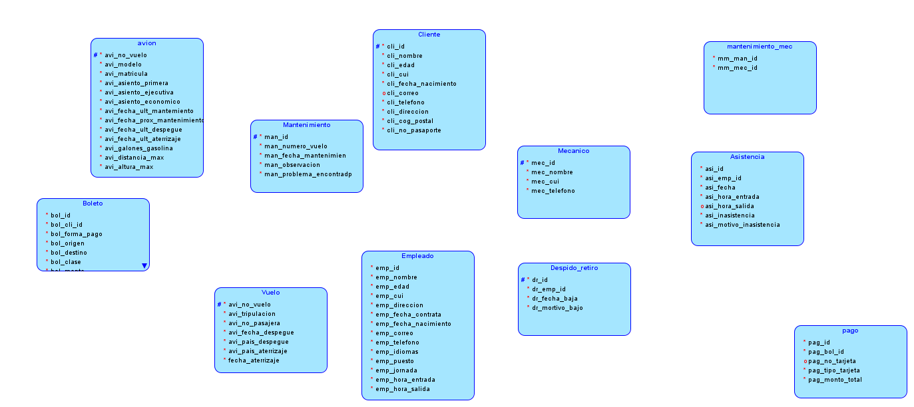
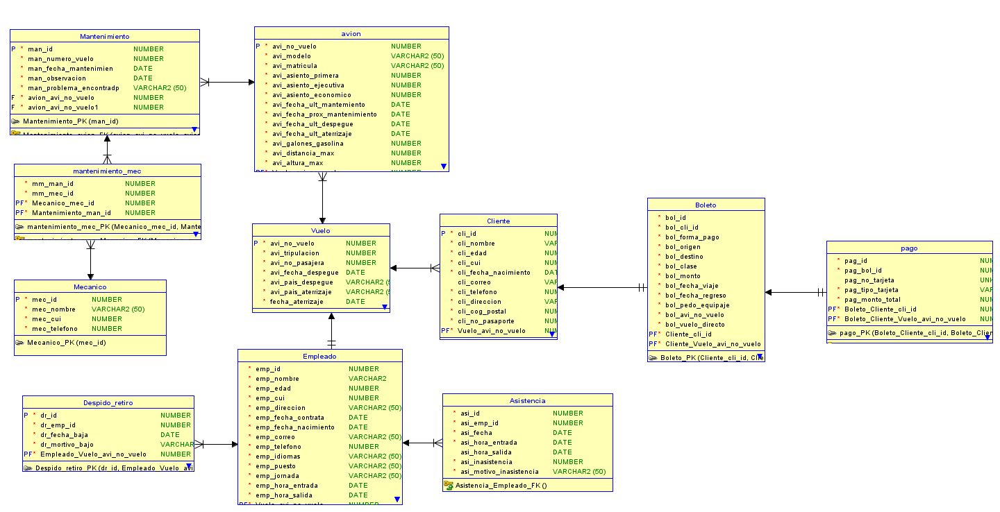

# DOCUMENTACION

**Avion**
- avi_No_vuelo
- avi_modelo
- avi_matricula
- avi_asientos_primera
- avi_asientos_ejecutiva
- avi_asientos_economica
- avi_fecha_ultimo_mantenimiento
- avi_fecha_proximo_mantenimiento
- avi_fecha_hora_ult_despege
- avi_fecha_hora_ult_aterrizaje
- avi_galones_gasolina
- avi_distancia_max
- avi_altura_max

**Mantenimiento**
- man_id
- man_numero_vuelo
- man_fecha_hora_manteni
- man_observaciones
- man_problema_encontrado

**Mecanico**
- mec_id
- mec_nombre
- mec_apellido
- mec_cui
- mec_telefono

**Mantenimiento_mec**
- mm_man_id (foranea)
- mm_mec_id (foranea)

**Empleado**
- emp_id (#) 
- emp_nombre
- emp_apellido
- emp_edad
- emp_cui
- emp_direccion
- emp_fecha_contrata
- emp_fecha_nacimiento
- emp_correo
- emp_telefono
- emp_idiomas
- emp_puesto
- emp_jornada
- emp_hora_entrada
- emp_hora_salida

**Despido_Retiro**
- dr_id (#)
- dr_emp_id (foranea)
- dr_fecha_baja
- dr_motivo_baja

**Asistencia**
- Asi_id (#)
- Asi_emp_id (foranes)
- Asi_fecha
- Asi_hora_entrada
- Asi_hora_salida
- Asi_inasistencia
- Asi_motivo_inasistencia

**Cliente**
- cli_id
- cli_nombre
- cli_edad
- cli_cui
- cli_fecha_nacimiento
- cli_correo
- cli_telefono
- cli_direccion
- cli_cog_postal
- cli_No_pasaporte

**Boleto**
- bol_id (#)
- bol_cli_id (foranea)
- bol_forma_pago
- bol_origen
- bol_destino
- bol_clase
- bol_monto
- bol_fecha_viaje
- bol_fecha_regreso
- bol_pedo_equipaje
- bol_avi_No_vuelo (foranea)
- bol_vuelo_directo

**Pago**
- pag_id(#)
- pag_bol_id (foranea)
- pag_no_tarjeta
- pag_tipo_tarjeta
- pag_monto_total

**Vuelo**
- avi_no_vuelo (foranea)
- tripulacion (foranea empeleados)
- numero_pasajeros
- fecha_despegue
- pais_despegue
- pais_aterrizaje
- fecha_aterrizaje

## MODELO LOGICO 

## MODELO RELACIONAL

## RELACIONES

### AVION
* Se establecio una relacion de uno a muchos con la tabla *Mantenimiento* ya que una avion puede recibir varios mantenimientos.

* Se establecio una realcion de uno a muchos con la tabla *vuelo* ya que un avion puede realizar varios vuelos. 

### MANTENIMIENTO
* Se establecio una relacion de uno a muchos con la tabla *mantenimiento_mec* esto para poder eliminar la realcion de varios a varios que se tiene con la tabla *Mecanico* ya que hay varios mantenimienos que pueden ser realizados por varios mecanicos distintos. 

### EMPLEADO 
* Se establecio una relacion de uno a muchos con la tabla *Despido_retiro* ya que que esta tabla puede contener la informacion sobre el despido o retiros de varios empleados. 
* Se Establecio una relacion de uno a muchos con la tabla *Asistencia* ya que en esta se estara registrando la asistencia de todos los empleados.

### CLIENTE
* Se establecio una relacion de uno a uno con la tabla *Boleto* ya que cada cliente solo podra registrar un boleto a su nombre por viaje . 

### BOLETO 
* Se establecio una relacion de uno a uno con la tabla *Pago* ya que un boleto solo tendra un registro sobre el pago del mismo. 

### VUELO
* Se establecio una relacion de uno a mucho con la tabla *cliente* ya que un velo contara con una serie de clienes.
* Se establecio una realcion de uno a muchos con la tabla *empleados* ya que un vuelo contara con al menos 10 empleados por vuelo. 